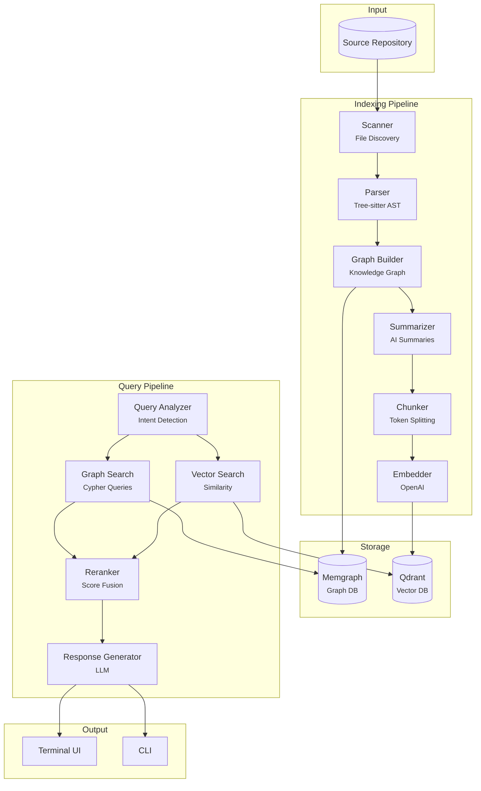
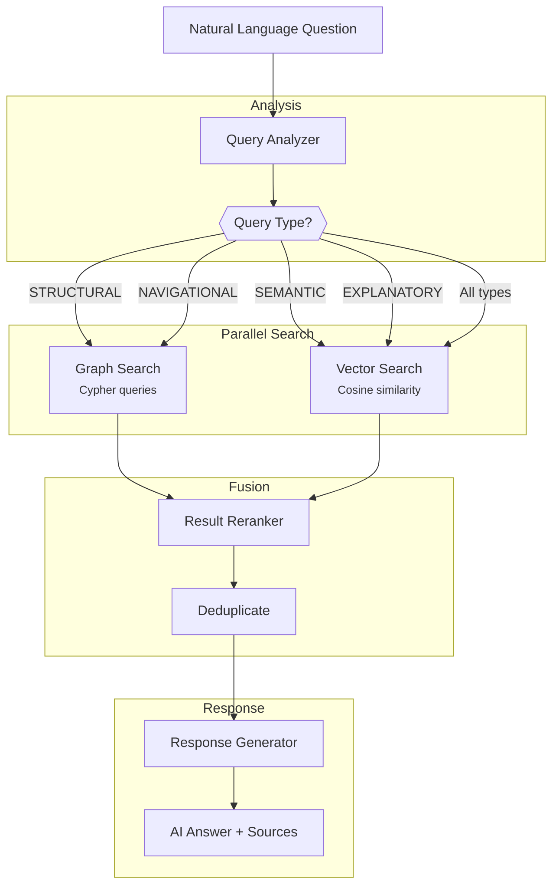
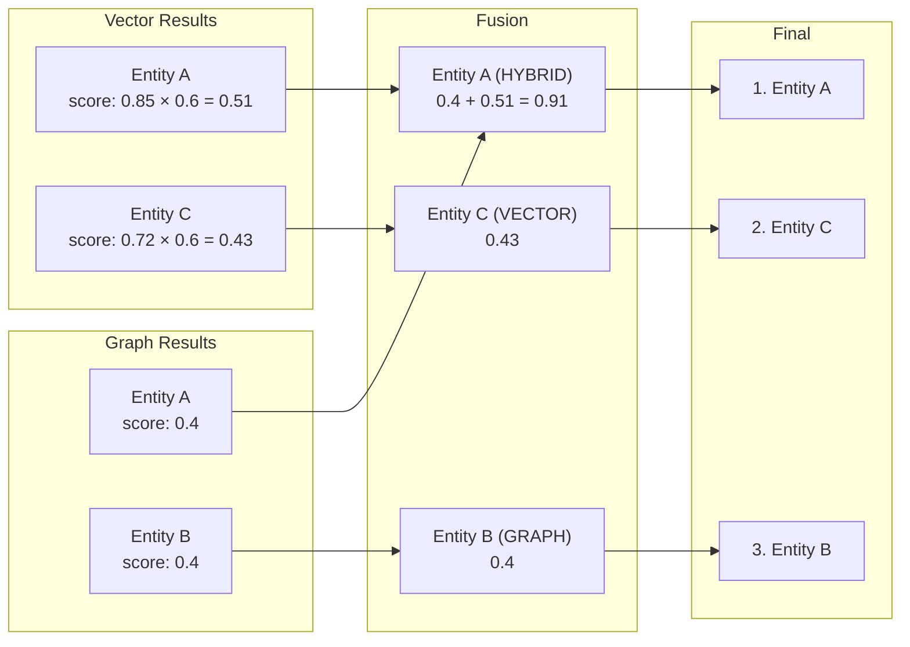
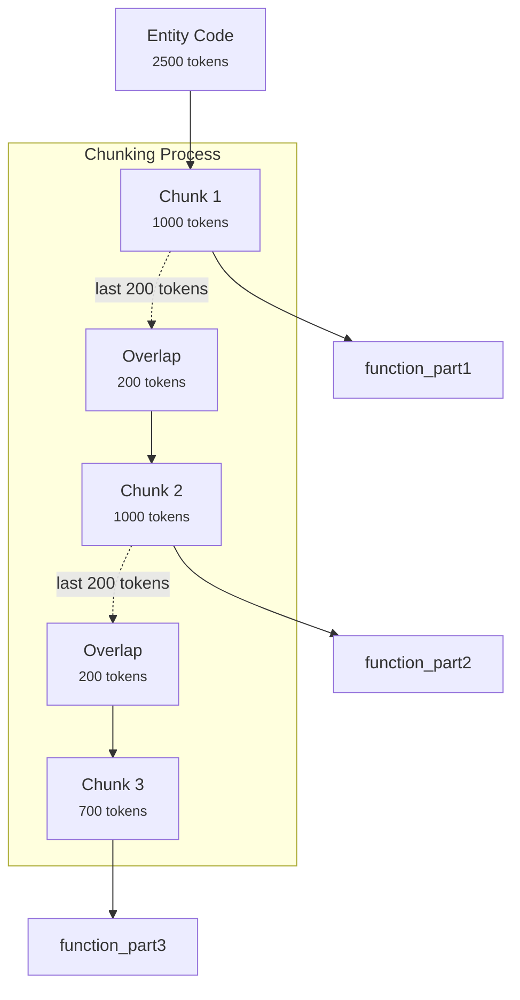
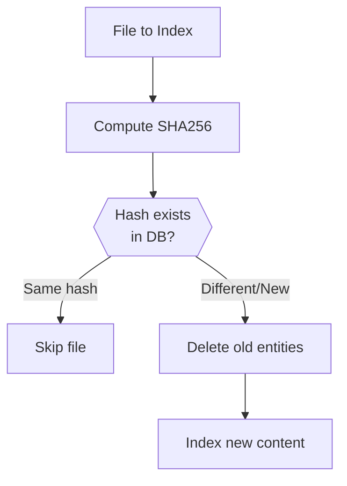

# Code RAG

A **hybrid Retrieval Augmented Generation (RAG) system** for code repositories that combines graph-based structural search with vector-based semantic search, powered by AI summarization and a Terminal User Interface.

## Overview

Code RAG indexes codebases by parsing source files into AST, building a knowledge graph of code relationships, generating AI summaries, and creating semantic embeddings. Users can then query using natural language to get AI-generated answers backed by relevant code snippets.

**Key Differentiators:**
- **Dual Search Strategy**: Combines structural graph queries (calls, inheritance, imports) with semantic vector similarity
- **Accurate AST Parsing**: Uses Tree-sitter for precise code entity extraction (not regex-based)
- **Incremental Indexing**: SHA256 hash-based change detection for fast re-indexing
- **AI-Powered Understanding**: GPT-4o summaries for files and entities

## System Architecture



## Indexing Pipeline

The indexing pipeline transforms source code into searchable knowledge through five sequential stages:

```mermaid
flowchart LR
    subgraph "1. Scanning"
        S1["Walk directory tree"]
        S2["Filter by extension"]
        S3["Compute SHA256 hash"]
        S1 --> S2 --> S3
    end

    subgraph "2. Parsing"
        P1["Tree-sitter AST"]
        P2["Extract imports"]
        P3["Extract entities"]
        P1 --> P2 --> P3
    end

    subgraph "3. Graph Building"
        G1["Create nodes"]
        G2["Create relationships"]
        G3["Incremental update"]
        G1 --> G2 --> G3
    end

    subgraph "4. Summarizing"
        SU1["File summaries"]
        SU2["Entity summaries"]
        SU1 --> SU2
    end

    subgraph "5. Embedding"
        E1["Chunk by tokens"]
        E2["Generate embeddings"]
        E3["Upsert to Qdrant"]
        E1 --> E2 --> E3
    end

    S3 --> P1
    P3 --> G1
    G3 --> SU1
    SU2 --> E1
```



### Stage Details

| Stage | Component | Purpose | Output |
|-------|-----------|---------|--------|
| **Scanning** | `FileScanner` | Discover files, compute hashes | `FileInfo` objects |
| **Parsing** | `CodeParser` + Extractors | AST parsing, entity extraction | `ParsedFile` with entities |
| **Graph Building** | `GraphBuilder` | Create Memgraph nodes/edges | Knowledge graph |
| **Summarizing** | `CodeSummarizer` | Generate AI descriptions | Summaries for entities |
| **Embedding** | `CodeChunker` + `OpenAIEmbedder` | Vectorize code chunks | Qdrant vectors |

## Query Pipeline

Queries are processed through hybrid search combining structural and semantic retrieval:



### Query Types

| Type | Triggers | Intent | Search Strategy |
|------|----------|--------|-----------------|
| **Structural** | "what calls", "who calls", "extends" | Find callers/callees/hierarchy | Graph-first |
| **Navigational** | "show me", "find the", "where is" | Locate specific entity | Graph + Vector |
| **Explanatory** | "how does", "explain", "what does...do" | Understand functionality | Vector + Summaries |
| **Semantic** | (default) | General search | Vector similarity |

## Knowledge Graph Schema

```mermaid
erDiagram
    Project ||--o{ File : "contains"
    File ||--o{ Class : "DEFINES"
    File ||--o{ Function : "DEFINES"
    File ||--o{ Import : "IMPORTS"
    Class ||--o{ Method : "DEFINES_METHOD"
    Class ||--o{ Class : "EXTENDS"
    Function ||--o{ Function : "CALLS"
    Method ||--o{ Function : "CALLS"
    Method ||--o{ Method : "CALLS"

    Project {
        string name
        string path
        datetime created_at
        datetime last_indexed_at
    }

    File {
        string path PK
        string name
        string language
        string hash
        int line_count
        string summary
    }

    Class {
        string qualified_name PK
        string name
        string signature
        string docstring
        string summary
        int start_line
        int end_line
    }

    Function {
        string qualified_name PK
        string name
        string signature
        string docstring
        boolean is_async
        int start_line
        int end_line
    }

    Method {
        string qualified_name PK
        string name
        string signature
        boolean is_async
        boolean is_static
        boolean is_classmethod
        string parent_class
    }

    Import {
        string name
        string alias
        string source
        boolean is_external
        int line_number
    }
```

## Hybrid Search & Reranking

The reranker combines results from graph (structural) and vector (semantic) searches:



**Scoring Weights:**
- Graph results: Fixed weight of **0.4**
- Vector results: Similarity score × **0.6**
- Hybrid (in both): Sum of weights

**Deduplication:**
- Key: `(file_path, entity_name, start_line)`
- Max 3 results per file (configurable)

## Code Chunking Algorithm

Large code entities are split into embeddable chunks with token-based overlap:



**Configuration:**
- `CHUNK_MAX_TOKENS`: 1000 (default)
- `CHUNK_OVERLAP_TOKENS`: 200 (default)
- Encoding: `cl100k_base` (tiktoken)

## Project Structure

```
code-rag/
├── src/code_rag/
│   ├── main.py                 # CLI entry point
│   ├── config/
│   │   └── settings.py         # Pydantic settings with env vars
│   ├── core/
│   │   ├── types.py            # Enums (Language, EntityType, QueryType)
│   │   ├── protocols.py        # Protocol definitions for DI
│   │   └── errors.py           # Exception hierarchy
│   ├── parsing/
│   │   ├── scanner.py          # File discovery with hash
│   │   ├── parser.py           # Tree-sitter orchestration
│   │   ├── models.py           # Pydantic models (ParsedFile, CodeEntity)
│   │   └── extractors/         # Language-specific extractors
│   │       ├── base.py         # Abstract base extractor
│   │       ├── python.py       # Python AST extraction
│   │       ├── javascript.py   # JS/JSX extraction
│   │       └── typescript.py   # TS/TSX extraction
│   ├── graph/
│   │   ├── client.py           # Memgraph async client
│   │   ├── builder.py          # Node/relationship creation
│   │   ├── queries.py          # Cypher query templates
│   │   └── schema.py           # Index creation
│   ├── embeddings/
│   │   ├── embedder.py         # OpenAI embedding with retry
│   │   ├── chunker.py          # Token-based code chunking
│   │   ├── client.py           # Qdrant async client
│   │   └── indexer.py          # Vector upsert orchestration
│   ├── summarization/
│   │   ├── summarizer.py       # GPT-4o summary generation
│   │   └── prompts.py          # LLM prompt templates
│   ├── query/
│   │   ├── engine.py           # Hybrid search orchestrator
│   │   ├── graph_search.py     # Cypher-based search
│   │   ├── vector_search.py    # Qdrant similarity search
│   │   ├── reranker.py         # Score fusion & deduplication
│   │   └── responder.py        # LLM response generation
│   ├── pipeline/
│   │   ├── orchestrator.py     # Full indexing pipeline
│   │   └── progress.py         # Progress tracking
│   └── tui/
│       ├── app.py              # Textual app entry
│       └── screens/            # Home, Indexing, Query, Settings
├── tests/
│   └── fixtures/sample_project # Multi-language test codebase
├── docker-compose.yml          # Memgraph + Qdrant services
└── pyproject.toml              # Project configuration
```

## Quick Start

### 1. Install

```bash
cd code-rag
pip install -e .
```

### 2. Configure

```bash
cp .env.example .env
# Edit .env and add your OPENAI_API_KEY
```

### 3. Start Infrastructure

```bash
docker-compose up -d
```

This starts:
- **Memgraph**: Graph DB on port 7687, Lab UI on port 3000
- **Qdrant**: Vector DB on port 6333 (HTTP), 6334 (gRPC)

### 4. Run

```bash
# Launch TUI
code-rag

# Or use CLI
code-rag index /path/to/repo --name "my-project"
code-rag query "How does authentication work?"
code-rag search "password hashing"
code-rag status
```

## Configuration

### Environment Variables

| Variable | Description | Default |
|----------|-------------|---------|
| `OPENAI_API_KEY` | OpenAI API key | **Required** |
| `MEMGRAPH_HOST` | Memgraph hostname | `localhost` |
| `MEMGRAPH_PORT` | Memgraph Bolt port | `7687` |
| `QDRANT_HOST` | Qdrant hostname | `localhost` |
| `QDRANT_PORT` | Qdrant HTTP port | `6333` |
| `LLM_MODEL` | Model for summaries/responses | `gpt-4o` |
| `EMBEDDING_MODEL` | Embedding model | `text-embedding-3-small` |
| `EMBEDDING_DIMENSIONS` | Vector dimensions | `1536` |
| `CHUNK_MAX_TOKENS` | Max tokens per chunk | `1000` |
| `CHUNK_OVERLAP_TOKENS` | Overlap between chunks | `200` |
| `MAX_CONCURRENT_REQUESTS` | Concurrent API calls | `5` |
| `BATCH_SIZE` | Embedding batch size | `100` |

### Supported Languages

| Language | Extensions | Extractor |
|----------|------------|-----------|
| Python | `.py` | `PythonExtractor` |
| JavaScript | `.js`, `.jsx` | `JavaScriptExtractor` |
| TypeScript | `.ts`, `.tsx` | `TypeScriptExtractor` |

## Example Queries

```bash
# Structural queries (use graph search)
"What functions call authenticate?"
"Show me the class hierarchy for UserRepository"
"What does the AuthService import?"

# Semantic queries (use vector search)
"Find code that handles password hashing"
"Where is form validation implemented?"

# Explanatory queries (use both + summaries)
"How does the authentication flow work?"
"Explain the UserProfile component"
```

## Key Design Patterns

| Pattern | Usage |
|---------|-------|
| **Protocol Pattern** | Dependency inversion via `typing.Protocol` |
| **Strategy Pattern** | Language-specific extractors |
| **Builder Pattern** | Incremental graph construction |
| **Facade Pattern** | `QueryEngine` unifies subsystems |
| **Context Manager** | Resource cleanup for DB connections |

## Incremental Indexing

Files are re-indexed only when their content changes:



## Development

```bash
# Install dev dependencies
pip install -e ".[dev]"

# Run tests
pytest

# Type checking
mypy src/code_rag

# Linting & formatting
ruff check src/code_rag
ruff format src/code_rag
```

## Debugging

- **Memgraph Lab**: http://localhost:3000 - Visualize graph, run Cypher
- **Qdrant Dashboard**: http://localhost:6333/dashboard - Inspect vectors
- **Logs**: Configure Python logging at DEBUG level

### Useful Cypher Queries

```cypher
-- Find function call graph
MATCH path = (caller)-[:CALLS*1..3]->(callee)
WHERE caller.name = "authenticate"
RETURN path;

-- Class hierarchy
MATCH path = (child:Class)-[:EXTENDS*]->(parent:Class)
RETURN path;

-- Entity statistics
MATCH (f:File) WITH count(f) as files
MATCH (c:Class) WITH files, count(c) as classes
MATCH (fn:Function) WITH files, classes, count(fn) as functions
MATCH (m:Method) RETURN files, classes, functions, count(m) as methods;
```

## License

MIT
